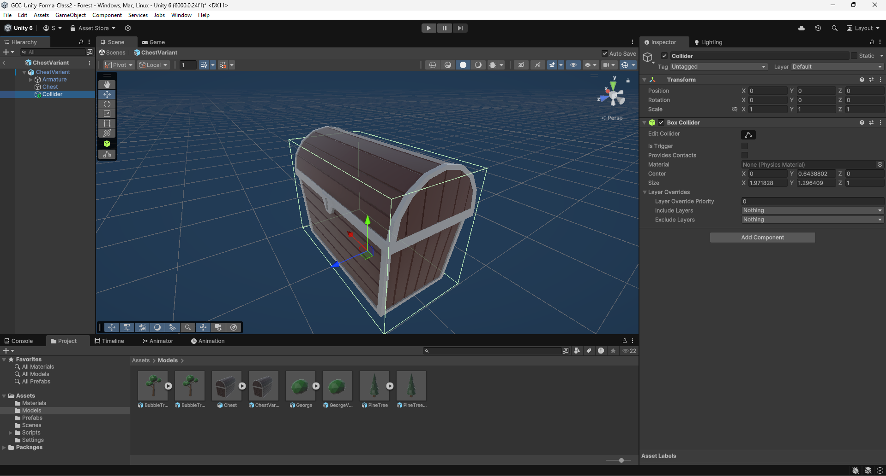

# Class 2

In this second class, you'll learn the following:
- creating a new scene
- importing and using a 3D model
- understanding more advanced physics systems (layers, raycasts)
- creating a script


## Creating a new scene

We will start from where we stopped in the first class.
If you want, you can clone the repository of the [first class](https://github.com/Skydrag42/GCC_Unity_Forma_Class1) to have the same starting point.
Open your project from the Unity Hub.
In your project window, go to the `Scenes` folder and right-click, Create->Scene->Scene.
Lets name it *forest*. Double-click the asset to open the new scene.

There should be two default objects in the scene:
- a camera
- a light source (the sun)

We will start by adding a few other elements:
- a plane to act as the ground (scale it up a notch)
- the player (don't forget to remove the previous camera)

If you want your objects to always get created with a position of (0,0,0), you can go to Edit->Preferences->Scene View
and select Create Objects at Origin.


Your scene should now look something like this:


## Importing 3D models

### Adding the trees

We will start by importing a simple lowpoly tree. 
You can find it in the [ClassTutorialAssets folder](ClassTutorialAssets/class2/BubbleTree.fbx) under the name *BubbleTree.fbx*.
To import it, drag and drop the file into a folder of your project window (*Models* in my case).
This creates a special prefab that you can directly use in your project, but you won't be able to modify it that much.


Lets add a few trees to our scene. Rotating and scaling them creates some variety, making the scene less uniform.
If your object ends up above ground after scaling with the scene view handle, try setting the tool mode to `Pivot` instead of `Center`.
It will make the tools work from the origin (or pivot point) of your objects.


You can add the *PineTree* model and the bush (*George*) if you want to add more diversity to your scene.
Don't forget to keep your hierarchy organized or you'll have a hard time finding your objects later.


### Setting colliders

Test the scene, and try bumping into a tree. Oh, *flûte*! You go right through them.
That's because we haven't set any colliders for the objects.

To do so, we have to go to the import settings of the models. 
Select your tree asset, and in the inspector, go to the `model` tab.
If look at the *Meshes* category, you should see a setting called *Generate Colliders*.
Tick it, scroll to the bottom and press `Apply`.


Now select any of your instanciated trees, and you should see a new component `MeshCollider`. 
If you try and run the scene again now, you should not be able to pass through the tree anymore.

However, doing so has a few downsides. Since it creates a collider matching the model exactly, 
it can become quite inefficient the more objects are added. 
So unless you really the precision on your model, we will prefer another method which consists in using primitive (so simpler) colliders.

For that, lets first untick the option and apply the changes. We will now have to create a prefab variant of our model,
so that all our instances share the same properties. Select your asset, right-click, Create->Scene->Prefab Variant.
Doing so instead of directly changing the model asset will allow for modifications to the 3D model without having 
to add the colliders again every time. 

Enter prefab mode for the newly created prefab.
You now have to options. Either you add the colliders as components of the root object, 
or you add them as children. I'll go for the second option. 
Since the model is quite simple, I'll only add one box collider to act as the trunk.
You can click on the `Edit Collider` button to edit the shape of the collider directly from the scene view
(hover over the button for tooltip).


Save your prefab, exit prefab mode, and try your scene. 
Mmh... It does not work. Try to guess why. 

The problem is that we are still using the old prefab in our scene. 
Thankfully for us, if you right-click on a tree in your hierarchy, you'll see under Prefab an option called `Replace...`.
Right under is an option called `Replace and keep overrides...`. Use it (if available) 
to prevent resetting the position and other changes. Select your new prefab and you should be good! 
Don't forget to change all your instances (select them all to do it all at once).


And we're all good with our trees!

### Importing a chest

Now that you know how it works, do the same for the *Chest* model. Don't forget to add the collider.
If you did it correctly, it should look like this:



## A bit of scripting

Our goal now is to be able to open the chest. So we'll need to interact in some way with it. 
One way is by using what's called `Raycasts`.

### Making it reusable

But before we do anything, let's try structuring a bit. We want to interact with the chest, but maybe other objects too. 
So it would be great if we could address all the interactable objects the same way, and define a custom behaviour for each object.
A good way to do so is by creating an `Interface`. Another would be using abstract classes 
(they do come with advantages regarding the unity inspector, but we won't be covering all the aspects of C# scripting in this class).
It's almost like a blueprint that contains the different methods and variables that our objects will hold, 
without defining their behaviour.

To create a new C# script, go to your project window, right-click, Create->Scripting->Empty C# script. 
Name it *IInteractable* (with two I, the first one for interface). Then, double click on your script to open it in your editor.

We won't be using any of the default code generated when creating the script, so you can delete everything.
Instead, we'll be writing the following:
```cs
public interface IInteractable 
{
	public void Interact();
}
```
This code defines the IInteractable interface and says that every object using this interface 
will have to contain a method named `Interact()`.

### The chest script

We can now create another empty Script and call it `Chest`. This time, we'll start by making sure the Chest script uses our interface:
```cs
public class Chest : MonoBehaviour, IInteractable
{

}
```
`Monobehaviour` is a class defining the behaviour of Unity object. 
It is required if you want your script to be used as a component on any GameObject.


We will now write the behaviour of our `Interact()` method:
```cs
public class Chest : MonoBehaviour, IInteractable
{
	public void Interact()
	{
		Debug.Log("Interacting with chest.");
	}
}
```
The `Debug.Log()` prints a message to the console window in the unity editor.
It is useful for quick testing of a script, but should be removed from your scripts when releasing your game.
We will be adding more things to this method later in the class.

Now that we have created the script for our chest, we can go to its prefab and add it to the root object 
(drag and drop the script to the inspector or find it using Add Component).


### The player script

Okay, we've set up our chest, but if we try the scene now, nothing happens.
That's because nothing is actually calling the method we defined earlier. 
What we need to do, is to make the user trigger the interaction by pressing a button.

#### Retrieving user input

Let's create another script (but this time select the *MonoBehaviour Script* option) and call it `Interactor`.
You can already add it to the player prefab before opening it.
As you can see, two methods are generated automatically. The first one, `Start`, 
is called once every time when the scripts is enabled in the scene. 
The second one, `Update`, is called every frame while the script is enabled.

Before we do the actual scripting, let's quickly test if the chest is working.
Add a reference to the chest script:
```cs
public class Interactor : MonoBehaviour
{
    public Chest chest;

    ...
}
```

In the Start method, call the Interact method:
```cs
void Start()
{
    chest.Interact();
}
```

Don't forget to assign the chest reference in the editor 
by dragging the chest gameobject from your hierachy to the chest field in the inspector:


Now hit play mode, and if you've done everything correctly, you should see the message appear on the `Console` window.

You can also use the ``Input`` class methods to test out your scripts behaviours before using the `Input System`, 
which is longer to setup but way more powerful. To do so, you can use these kind of instructions:
```cs
void Update() 
{
	if (Input.GetKeyDown(KeyCode.E))
	{
		chest.Interact();
	}
}
```

Once you're done testing, you can remove all the content of the class as we won't be using either the Start nor the Update.
Instead, we will receive the inputs from the Input System:
```cs
using UnityEngine.InputSystem;

public class Interactor : MonoBehaviour
{
	private bool interactRequested = false;

	public void GetInteract(InputAction.CallbackContext context)
	{
		if (context.performed)
		{
			interactRequested = true;
		}
	}
}
```

You can then hook the `GetInteract` method to the `PlayerInput` component on the player prefab.
Go to Events, Player, and click the  '+' button on the Interact Event list. 
Then, drag and drop any component of the player in the empty field (or the object from the hierarchy).
This will allow you to choose a method from any of the scripts attached to the object. 
Select *GetInteract*. 
If you do not see it, then you either haven't selected the correct object, your interactor script isn't on the object
or you haven't saved your script.


You can try if it works correctly by logging a message to the console near `interactRequested = true;`.

If you are very thorough with your testing, you should see that it only works if you press long enough on the key.
That's because by default, the interact action comes with a `Hold` setting. Go to your input actions settings and get rid of it (don't forget to save).


#### The raycast

We're almost done with the scripting! 
What we want next is to make sure the interaction only happens when the player is directly looking at the chest.
We could try to check if the object is visible in the frame, close to the middle of the screen, but then we'd also need to check the distance from the player.

A simple way to achieve this is by using `Raycasts`. A raycast is an imaginary ray calculated by the physics engine.
We give a starting position, a direction and a distance, and we can get the information of any objects the ray collided with.

Since it is calculated by the physics engine, we'll be using another default method of the MonoBehaviour class, `FixedUpdate`.
It works like the `Update`, but is run every physics step (every 0.02 sec by default) instead of every frame (variable).

```cs
public float maxInteractionDistance = 3f;

RaycastHit hitInfo;
private void FixedUpdate()
{
    if (Physics.Raycast(Camera.main.ViewportPointToRay(new Vector3(.5f, .5f)), out hitInfo, maxInteractionDistance))
    {
        Debug.Log("Looking at object " + hitInfo.collider.name);
    }
}
```

First, we define a maximum distance for our ray (in meters). 
We also have to create a `RaycastHit` variable that will hold the data of the object we hit. 
To create our ray, we retrieve the current camera with `Camera.main`, then use one of its method with a point representing the center of the viewport.
This will create a ray that starts at the center of the camera with the same direction as the forward vector of the camera.
We then pass all our settings to the Raycast method and check the result.

If you try it now, you should see the name of the objects you look at pop up in the console window at a frightening speed.

To prevent such unnecessary computation, we will encapsulate this code with our `interactionRequested` boolean, 
so that we only raycast when pressing interact:
```cs
private void FixedUpdate()
{
	if (interactionRequested)
	{
		interactionRequested = false;
		if (Physics.Raycast(Camera.main.ViewportPointToRay(new Vector3(.5f, .5f)), out hitInfo, maxInteractionDistance))
		{
			Debug.Log("Looking at object" + hitInfo.collider.name);
		}
	}
}
```

All that's left to do is to check if the object is IInteractable, and if so, call Interact on it.
Replace the call to Debug.Log with these two lines:
```cs
IInteractable interactable = hitInfo.collider.GetComponentInParent<IInteractable>();
if (interactable != null) interactable.Interact();
```
This will search for an IInteractable component in the object or any of its parent. 
Depending on the way you set up the collider, the chest script will either be on the same object as the collider or on a parent (the root).
Then, if we did find an IInteractable component, we interact.

And it should work! If not, try going through the steps again and see if you've missed anything. 
If you still have troubles, add some `Debug.Log()` lines to try and pinpoint where exactly it's not working. 

#### Optimizing further

As it is now, optimizing isn't really necessary. The question would be more relevant if we were doing the raycast more often (e.g. every frame).
To know if you need to optimize your code, you should use the [unity profiler](https://docs.unity3d.com/Manual/Profiler.html). But for the sake of the course, we'll do it anyway.

What's happening right now is that each time we do a raycast, the physics engine looks through all possible objects 
(not exactly, there are physics optimizations) to see if we touch anything. 
We can help the engine by adding a physics `layer` to our object. 
With this, we'll tell the raycast to only look for objects inside that layer.
This is the same concept that the one used for the player's ground check.

The same way you added the `Player` layer in the first class, add an `Interactable` layer.

We also need to update our script. 
Add a new variable
```cs
public LayerMask interactableLayer;
```
and use it as a fourth parameter in your call to Physics.Raycast:
```cs
Physics.Raycast(Camera.main.ViewportPointToRay(new Vector3(.5f, .5f)), out hitInfo, maxInteractionDistance, interactableLayer)
```

Then, in your inspector, change the Interactor `interactableLayer` value to the newly created layer.

If you try it now, nothing happens anymore. That's because the chest collider is currently set to the `Default` layer.
The simplest solution would be to change its layer from Default to Interactable. 
However, doing so will remove the chest from the player ground check, 
and going on the chest would be equivalent to falling while not moving (and building up your downwards acceleration).

You might say "Ok, then let's add Interactable to the ground check layer mask of the player". 
But what if you have objects you want to interact with, but that are nt considered ground?

To solve our issue, we will be adding a special type of collider to our interactable object, called a trigger.
They work the same way, except that you cannot physically collide with them. 
The collisions are still recorded and can be used through methods like `OnTriggerEnter` 
(there also exists `OnColliderEnter` for normal colliders, check the [documentation](https://docs.unity3d.com/ScriptReference/Collider.OnCollisionEnter.html) for more informaton)
or via raycasts.

In your chest prefab, add a new collider in a child object, and set its `IsTrigger` value to true. Don't forget to set the layer.


## Conclusion

And with this, you should be done for this class!
Don't forget to train what you learned, for example by adding new interactable objects.
You could make a mushroom prefab out of primitives, and try to make it disappear (using `Destroy(gameObject)` could help). 

See you later!

*course by Julien Charvet for GCC*